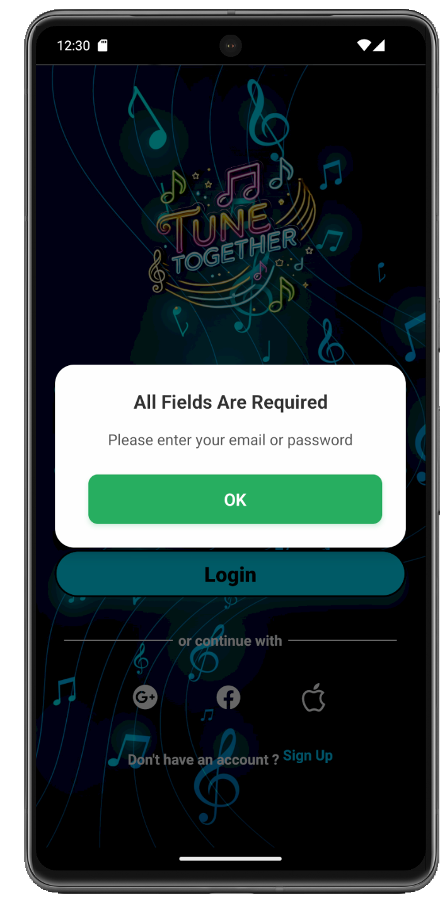
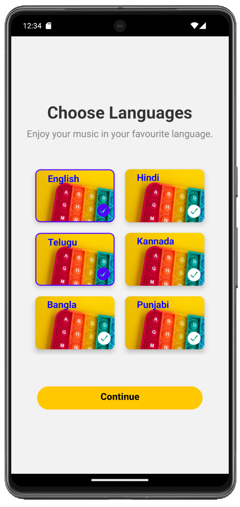
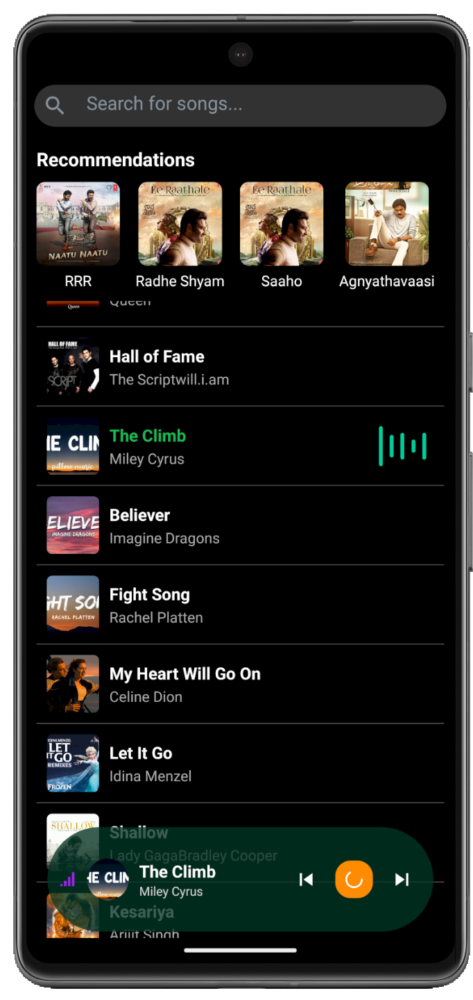
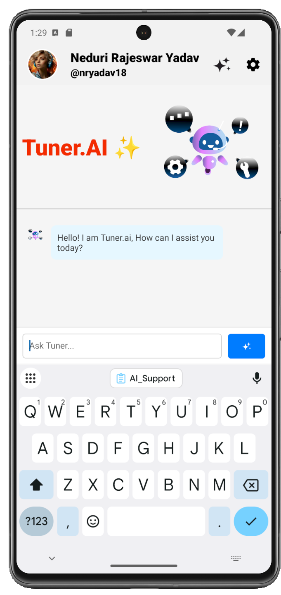

<h1 align="center" style="font-size:40px;">Nike Shoe Slider</h1>
<h3 align="center">Connecting People over the Music!</h3>

---

## 🎬 App Demo

<p align="center">
  
  
  
</p>

<p align="center">
  
  
  
</p>

<p align="center">
  
  
  
</p>

<p align="center">
  
  
  
</p>

<p align="center">
  
  
  
</p>

<p align="center">
  
  
  
</p>

<p align="center">
  
  
  
</p>

<p align="center">
  
  
  
</p>

<p align="center">
  
  
  
</p>

<p align="center">
  
  
  
</p>

<p align="center">
  
  
  
</p>

<p align="center">
  
  
  
</p>

<p align="center">
  
  
  
</p>

<p align="center">
  
  
  
</p>

<p align="center">
  
  
  
</p>

<p align="center">
  
  
  
</p>

---

## 📂 Folder Structure

tune-together:
1. screens # 📱 React Native frontend screens
2. assets # 🧠 Image, JSON, Video Assets
3. outputs # 🧪 App Working Screens

---


## 🧰 Tech Stack

### 💻 Frontend (visible/)
- React Native Expo SDK 53
- Firebase Cloud Messaging (v1)
- Expo Secure Storage + Biometrics
- EAS Build system

### 🔧 Backend (invisible/)
- Node.js + Express.js
- MongoDB + Vector Search
- Gemini Pro 2.5 LLM (via Vertex AI)

---

### Clone the repo
```bash
git clone https://github.com/nryadav18/tunetogether.git
cd tunetogether
```

### Installation
```bash
cd visible
npm install
```
### Running the Frontend
```bash
npx expo start -c
```
